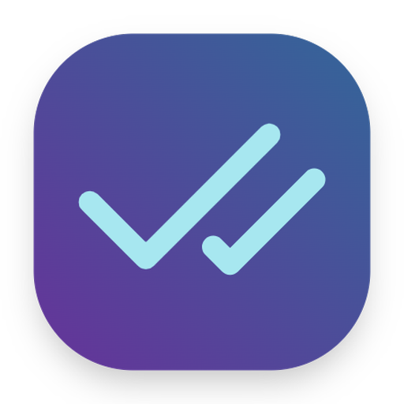
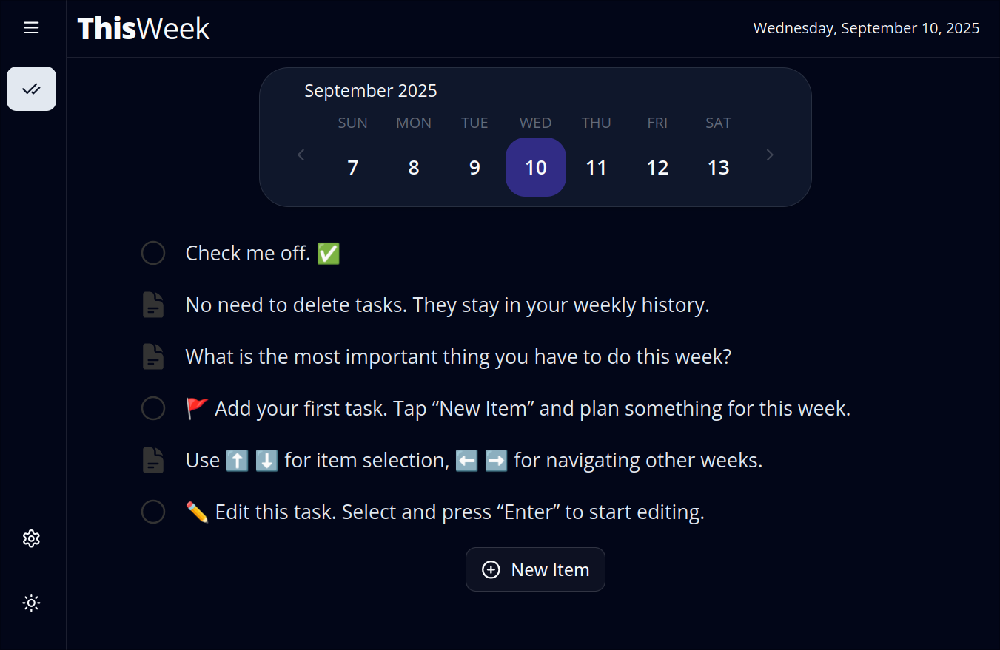

<h1 style="display:inline;font-weight:600;">&nbsp;ThisWeek</h1>

&nbsp;

**ThisWeek** is a simple and offline-first weekly planner that helps you stay focused.  
Plan your todos, set goals, and take notes — all in one clean interface.  

[🌐 Try ThisWeek App](https://thisweek.me/)

## Screenshot 🖼️

## Motivation

>“The story starts with you. It ends with you.  
>You take the steps that need to be taken.  
>Every time you fall, you rise again.  
>And with each new week, you begin again.”  
>— shk

## Todos (Features) 📌

✅ Open source  
✅ Weekly planning with todos and notes  
✅ Works offline — data is stored in your browser  
✅ Multiple calendars and locales 🌐  
✅ Display secondary calendar dates  
🔲 Sync across multiple devices 📱 🔄 💻  
🔲 Nested todos/notes  
&nbsp;&nbsp;&nbsp;&nbsp;&nbsp;&nbsp;&nbsp;&nbsp;🔲 Add sub-items to individual todos/notes  
&nbsp;&nbsp;&nbsp;&nbsp;&nbsp;&nbsp;&nbsp;&nbsp;🔲 Group items under custom headings  
🔲 🗂️ Lists and Project-like organization  
🔲 🎯 Yearly goals and objectives  

## Notes 📝

Your data stays on your device.  
Built with React, TS, and love ❤️  
Feedback is always welcome.  

## Links 🔗

[🌐 ThisWeek App](https://thisweek.me/) (https://thisweek.me)  
[🐙 GitHub Repo](https://github.com/jeot/thisweek-web)  

## License

This project is licensed under the MIT License - see the [LICENSE](LICENSE) file for details.

